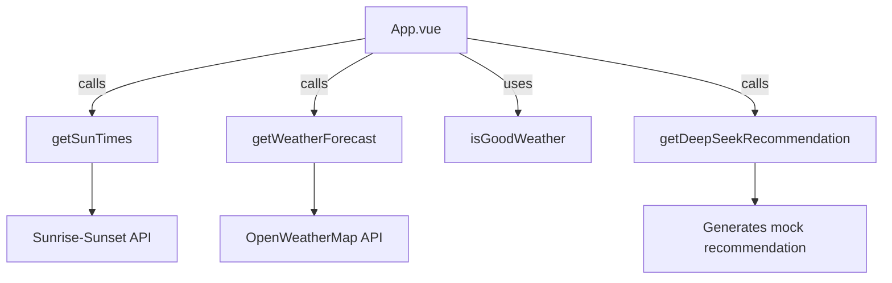

# Running Recommendation App Documentation

## Overview
Vue.js application that recommends optimal running times based on weather conditions and sunrise/sunset data.

## Key Components

### 1. App.vue
- Main Vue component
- Displays:
  - Optimal running time window
  - Weather summary
  - DeepSeek running recommendations
- Uses:
  - Composition API with TypeScript
  - Reactive state management (ref)
  - Async data fetching (onMounted)
  - ErrorBoundary component for error handling
- Template Structure:
  - Wrapped in ErrorBoundary component
  - Clean conditional rendering (loading/error/data states)
  - Properly nested div structure

### 2. ErrorBoundary.vue
- Error boundary component
- Features:
  - Catches and displays errors from child components
  - Provides "Try again" button
  - Styled error display
- Implementation:
  - Uses Vue's Composition API
  - Manages error state with ref
  - Slot-based content rendering

### 2. API Service (api.ts)
#### Weather Data Integration
- OpenWeatherMap API
- Parameters: temperature, humidity, wind speed, conditions
- Methods:
  - `getWeatherForecast()` - Gets 5-day forecast
  - `isGoodWeather()` - Evaluates if conditions are suitable for running
  - `getWeatherSummary()` - Creates display string

#### Sunrise/Sunset Integration
- sunrise-sunset.org API
- Methods:
  - `getSunTimes()` - Gets sunrise/sunset times

#### DeepSeek Recommendation
- Currently generates mock data
- Input: WeatherData object
- Output: Recommendation object with:
  - bestTime (string)
  - duration (string)
  - intensity (string)
  - reasoning (string)

## Data Flow

## Environment Variables
- VITE_WEATHER_API_KEY: OpenWeatherMap API key

## Future Improvements
1. Replace mock DeepSeek with real API integration
2. Add user preferences (distance, intensity preferences)
3. Implement caching for API responses
4. Add error handling for API failures